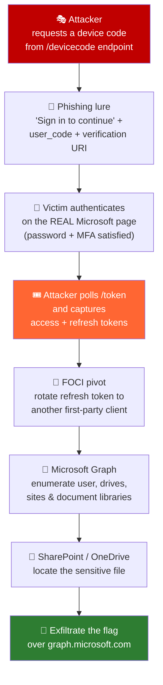

<div align="center">

# 🔐 TokenAbuse-Azure

### Compromising Microsoft 365 through identity, not the perimeter

**A red-team CTF challenge walkthrough: OAuth Device-Code phishing → token theft → Microsoft Graph enumeration → SharePoint exfiltration**


</div>

---

## 📌 Overview

**TokenAbuse-Azure** is a cloud red-team CTF challenge built around a single, dangerous idea:
in a modern cloud tenant, an attacker who never touches your network, never drops malware,
and never cracks a password can still walk out with your data — by abusing a *legitimate*
authentication flow that Microsoft ships and trusts by default.

This challenge chains together a realistic attack path:

1. **Abuse the OAuth 2.0 Device Authorization Grant** to start a sign-in the attacker controls.
2. **Phish a single user** into completing that sign-in (MFA included) on the real Microsoft login page.
3. **Capture the resulting access + refresh tokens** with [TokenTacticsV2](https://github.com/f-bader/TokenTacticsV2).
4. **Pivot across Microsoft first-party apps** using *Family of Client IDs* (FOCI) refresh-token rotation.
5. **Enumerate Microsoft Graph and SharePoint**, locate a sensitive document, and **exfiltrate the flag.**

The whole kill chain runs over Microsoft's own infrastructure (`login.microsoftonline.com`,
`graph.microsoft.com`) — there is no attacker-hosted phishing page to flag, no malicious binary
to detect, and the traffic looks like normal sign-in activity. That's exactly what makes it worth
understanding.

> 📖 **Full step-by-step solution → [WRITEUP.md](WRITEUP.md)**
> 🛡️ **Detection & hardening (blue-team view) → [docs/DETECTION_AND_MITIGATION.md](docs/DETECTION_AND_MITIGATION.md)**

---

## ⛓️ The attack chain



---

## 🎯 MITRE ATT&CK mapping

| Tactic | Technique | ID |
|--------|-----------|----|
| Initial Access | Phishing: Spearphishing Link | [T1566.002](https://attack.mitre.org/techniques/T1566/002/) |
| Credential Access | Steal Application Access Token | [T1528](https://attack.mitre.org/techniques/T1528/) |
| Defense Evasion / Persistence | Valid Accounts: Cloud Accounts | [T1078.004](https://attack.mitre.org/techniques/T1078/004/) |
| Lateral Movement | Use Alternate Authentication Material: Application Access Token | [T1550.001](https://attack.mitre.org/techniques/T1550/001/) |
| Collection | Data from Information Repositories: SharePoint | [T1213.002](https://attack.mitre.org/techniques/T1213/002/) |
| Exfiltration | Exfiltration Over Web Service | [T1567](https://attack.mitre.org/techniques/T1567/) |

---

## 🧰 Tooling

| Tool | Role in the chain |
|------|-------------------|
| [**TokenTacticsV2**](https://github.com/f-bader/TokenTacticsV2) | Device-code request, token polling/capture, FOCI refresh-token rotation |
| **Microsoft Graph REST API** | Identity, drive, site and file enumeration + download |
| **PowerShell 7** | Orchestration ([`scripts/device-code-abuse.ps1`](scripts/device-code-abuse.ps1)) |
| `curl` / `Invoke-RestMethod` | Raw Graph calls and file exfiltration |
| [jwt.ms](https://jwt.ms) | Inspecting captured token claims (`scp`, `aud`, `upn`) |

---

## 📁 Repository layout

```
TokenAbuse-Azure/
├── README.md                          # you are here — overview, chain, ATT&CK map
├── WRITEUP.md                         # full step-by-step solution
├── scripts/
│   └── device-code-abuse.ps1         # documented reproduction helper (lab use)
└── docs/
    └── DETECTION_AND_MITIGATION.md   # blue-team: detections, KQL, hardening
```

---

## 🔑 Key takeaways

- **MFA is not a finish line.** Device-code phishing happens *after* MFA — the victim completes
  the second factor on the genuine page, and the attacker still walks away with the tokens.
- **Refresh tokens are the real prize.** A single capture yields long-lived access and, via FOCI,
  reach across Outlook, OneDrive, SharePoint, Teams and the Graph — no second interaction needed.
- **Legitimate flows are the new attack surface.** There's no malware and no fake login page;
  defence has to move to *Conditional Access*, sign-in risk, and token-lifetime policy.

> 🛡️ The blue-team half of this story — how to detect and shut down each step — is in
> [docs/DETECTION_AND_MITIGATION.md](docs/DETECTION_AND_MITIGATION.md).

---

## ⚠️ Disclaimer

This repository documents the solution to an **authorized Capture-the-Flag challenge** and is
published strictly for **education, awareness, and defensive research**. Every technique shown is
publicly documented (including by [Microsoft](https://learn.microsoft.com/en-us/entra/identity-platform/v2-oauth2-device-code)).
Do **not** run any part of this against a tenant, user, or system you do not own or have explicit
written permission to test. The author accepts no liability for misuse.

---

<div align="center">
<sub>Solved & documented by <b>Mohammad Thabet Hassan</b> · part of the Exploit3rs cloud red-team series</sub>
</div>
